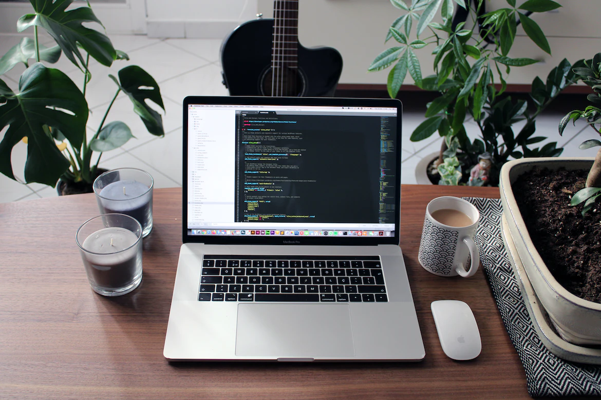

# APP Quiz Estética

> App criado para o projeto integrador das alunas do curso de estética do Senac Americana turma de 2022. Este projeto foi desenvolvido utilizando HTML, CSS e Javascript. 
### Lista de tarefas
Segue a lista de tarefas a serem desenvolvidas no projeto:
- [X] briefing e levantamento de requisitos
- [X] prototipação
	- https://www.figma.com/file/P0QTiuBnN16DEEqTpRi8qa/Quiz-Estetica?node-id=0%3A1
- [X] validação inicial
- [X] produção(programação)
    - [X] criar repositório no github
    - [ ] Criar a tela de perguntas
    - [ ] Criar a tela inicial
    - [ ] Criar a tela de resultados

## 📝 Licença
Esse projeto está sob licença. Veja o arquivo [LICENÇA](LICENSE.md) para mais detalhes.
[⬆ Voltar ao topo](#nome-do-projeto) 